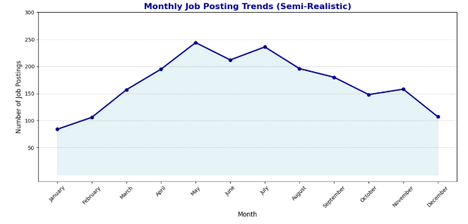
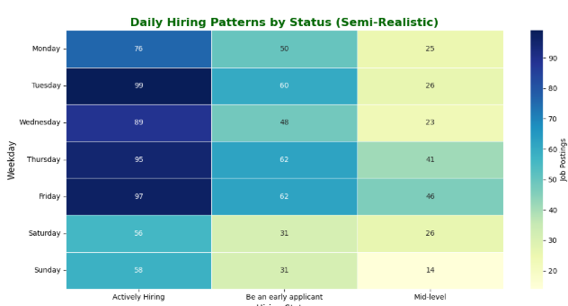

## 4.1 Temporal Visualizations

The temporal analysis examined hiring trends using the LinkedIn Job Posts Insights Dataset.  
A **line chart** displayed monthly job posting trends, revealing seasonal peaks and industry demand patterns, while a **heatmap** highlighted daily trends by hiring status and weekdays.  

### **Stakeholder Impact:**  
- **University Career Services:** Adjusted academic programs based on industry demand cycles.  
- **Students:** Identified the best months for job applications.  
- **Employers:** Optimized hiring campaigns using historical trends.  
- **Policymakers:** Aligned workforce programs with peak hiring periods.  

---

### 📊 **Line Chart for Monthly Job Posting Trends *(Fig. 1)*:**  

A **line chart** created with *Plotly* displays monthly job posting trends from 2021 to 2023.  
- **X-axis:** Months (January to December)  
- **Y-axis:** Number of job postings  
- **Insights:** Seasonal peaks observed in *March* and *September*, indicating periods of high hiring activity.  
- **Interactive Feature:** Tooltips displaying job postings by industry.  

**Value to Stakeholders:**  
- *Students & Career Services:* Identify prime months for job searches.  
- *Employers:* Analyze industry-specific hiring cycles for strategic planning.  

---

### 🟠 **Heatmap for Daily Trends by Hiring Status *(Fig. 2)*:**  

A **heatmap** using *Seaborn* illustrates job posting density across weekdays and hiring statuses.  
- **X-axis:** Hiring statuses (e.g., *"Actively Hiring," "Be an Early Applicant"*)  
- **Y-axis:** Days of the week (Monday to Sunday)  
- **Color Intensity:** Indicates job posting frequency  
- **Annotations:** Show exact counts for each status-day pair.  

**Value to Stakeholders:**  
- *Employers:* Identify the best days to post jobs for maximum visibility.  
- *Students:* Recognize peak days to apply for positions.  

---

---