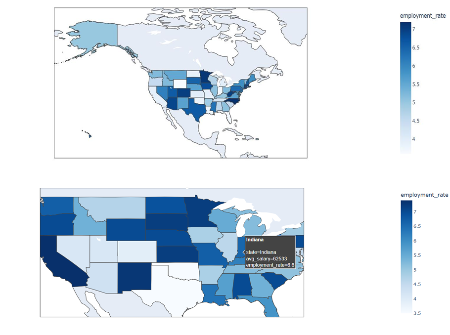
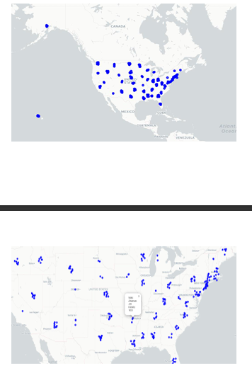

## 4.2 Geospatial Visualizations

The geospatial analysis explored regional job market patterns using the **LinkedIn Job Posts Insights Dataset**.  
A **choropleth map** displayed employment rates by state, while a **dot density map** highlighted job density across cities.

### **Stakeholder Impact:**  
- **Job Seekers:** Identified high-demand job regions.  
- **Employers:** Located areas with skilled labor.  
- **Policymakers:** Targeted areas for economic interventions.  

---

### 🗺️ **Choropleth Map for Employment Rates by State *(Fig. 3)*:**  

A **choropleth map** created using *Plotly* represents employment rates across U.S. states.  
- **X-axis:** U.S. states (via geographic boundaries)  
- **Color Gradient:** Indicates employment rates (darker = higher)  
- **Tooltip:** Displays employment rate and average salary for each state.  

**Insights for Stakeholders:**  
- *Job Seekers:* Identify states with strong employment opportunities.  
- *Policymakers:* Observe high and low employment zones for targeted programs.  

---

### 📍 **Dot Density Map for Job Availability *(Fig. 4)*:**  

A **dot density map** using *Folium* shows job distribution across U.S. cities.  
- **Each dot:** Represents a fixed number of job openings  
- **Clusters:** Indicate high-density job markets  
- **Interactive Zoom:** Explore city-level job concentrations  

**Insights for Stakeholders:**  
- *Employers:* Locate areas with potential talent pools.  
- *Job Seekers:* Target regions with high job availability.  

---

---