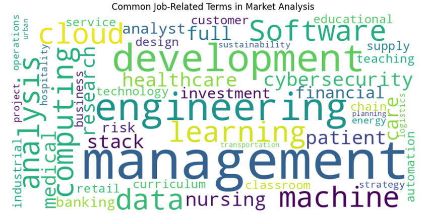
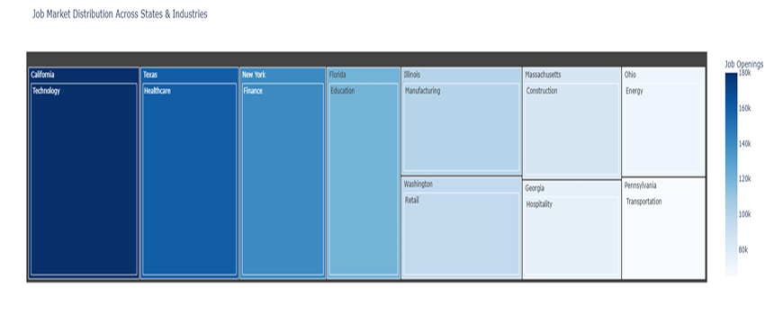

## 4.3 Linguistic Visualizations

The linguistic analysis extracted key skills and job-related terms from job descriptions using the **LinkedIn Job Posts Insights Dataset**.  
A **word cloud** highlighted in-demand skills, while a **bar chart** displayed the most frequent job functions.

### **Stakeholder Impact:**  
- **Job Seekers:** Focused on in-demand skills to improve resumes.  
- **Educators:** Aligned curricula with emerging skills.  
- **Employers:** Identified key competencies for job postings.  

---

### 🌟 **Word Cloud of Key Skills *(Fig. 5)*:**  

A **word cloud** created using *WordCloud (Python)* extracted terms from job descriptions.  
- **Font Size:** Indicates term frequency  
- **Color Variations:** Categorical grouping of technical vs. soft skills  

**Insights for Stakeholders:**  
- *Job Seekers:* Identify top skills for resumes.  
- *Educators:* Update curricula with relevant skills.  

---

### 📊 **Tree Map – Job Market Distribution Across States & Industries *(Fig. 6)*:**  

A **tree map** created using *Plotly* visualizes job openings by state and dominant industry, with color intensity representing job density.  

- **States:** Represented by large rectangles (*e.g., California, Texas, New York*).  
- **Industries:** Displayed within each state (*e.g., Technology for California, Healthcare for Texas*).  
- **Color Gradient:** Darker shades indicate higher job openings.  

**Insights for Stakeholders:**  
- **Job Seekers:** Identify which industries dominate in each state to target their job search.  
- **Employers:** Target workforce distribution and high-demand regions for recruitment.  
- **Policymakers:** Analyze regional employment trends to design workforce programs.  

---

---