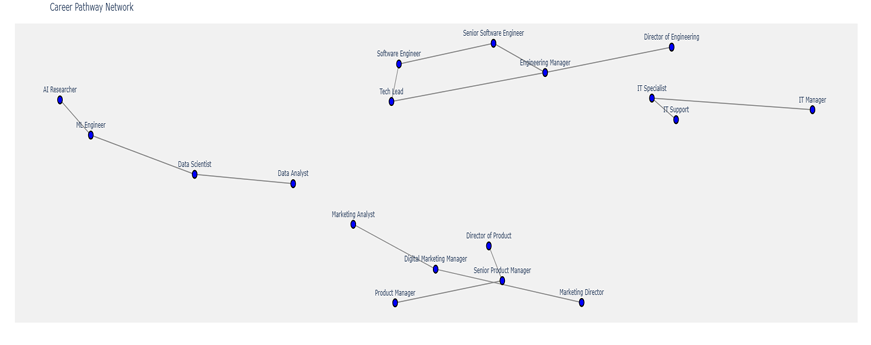
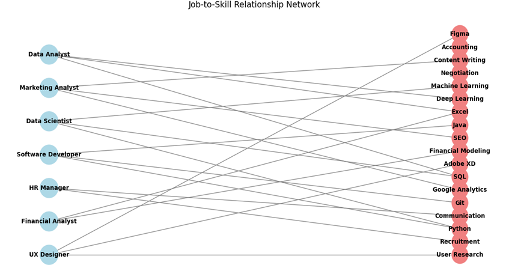

## 4.4 Network Visualizations

The network analysis mapped relationships between job roles and required skills, using the **LinkedIn Job Posts Insights Dataset**.  
Two types of networks were created: a **Career Pathway Network** showing job transitions and a **Job-to-Skill Relationship Network** showing key skill requirements.

### **Stakeholder Impact:**  
- **Job Seekers:** Explored career growth opportunities.  
- **Educators:** Mapped skills to job roles for curriculum design.  
- **Employers:** Identified skill gaps for training.  

---

### 🧩 **Career Pathway Network *(Fig. 7)*:**  

A **directed graph** using *NetworkX* visualizes career transitions between roles.  
- **Nodes:** Job titles (*e.g., Data Analyst, Data Scientist*)  
- **Edges:** Career transitions (*e.g., Analyst → Scientist*)  
- **Arrow Direction:** Indicates career progression  

**Insights for Stakeholders:**  
- *Job Seekers:* Understand career paths and possible transitions.  
- *Employers:* Design career development programs.  

---

### 🛠️ **Job-to-Skill Relationship Network *(Fig. 8)*:**  

A **bipartite graph** using *NetworkX* maps connections between jobs and skills.  
- **Left Nodes:** Job titles (*e.g., Machine Learning Engineer*)  
- **Right Nodes:** Skills (*e.g., Python, TensorFlow*)  
- **Edges:** Link jobs to required skills  

**Insights for Stakeholders:**  
- *Job Seekers:* Identify critical skills for desired roles.  
- *Educators:* Align curricula to industry needs.  
- *Employers:* Spot skill gaps in the workforce.  

---

---